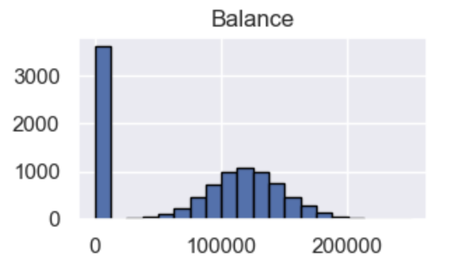
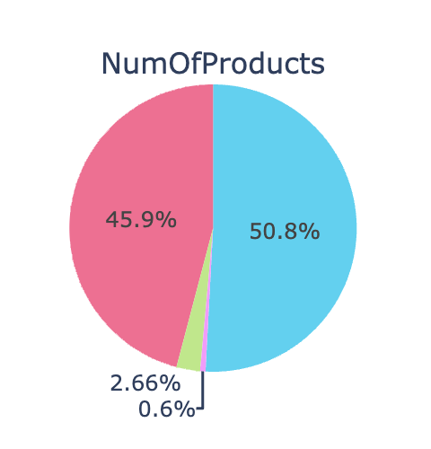
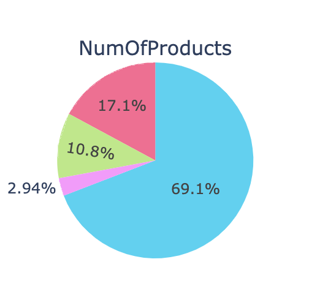
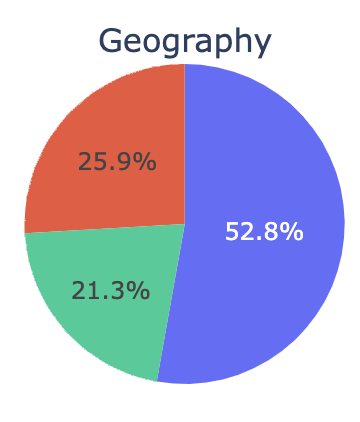
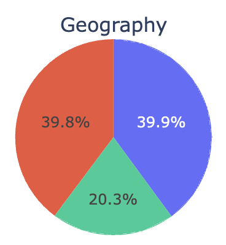

# Bank Customer Churn Exploratory Data Analysis 🏦 📊

This project is to perform Exploratory Data Anlaysis on Kaggle's Bank Churn Rate Data.

**Customer Churn**: the percentage of customers that stopped using your company's product or service during a certain time frame

Here, our goal is to find out what are the crucial factors that turn the customers down and makes them leave the business by adopting [APP framework](https://medium.com/illumination/how-to-conduct-an-effective-exploratory-data-analysis-eda-fa4e65ab7735) 🔍.

The framework helps one to analyse data by the following steps:

1. 🧐 Attention: This is a step when we get to know how our data looks like. For instances, what's the size of our dataset? What are the data types of our columns?
2. 🎯 Purpose: After a brief look of our data, we set the goal and direction of our EDA. It could be as simple as understanding our customers to spotting important features for our target prediction.
3. 📊 Process: The actual EDA! This involves getting basic summary statistics, data visualization, correation heatmap, pair plots and etc.

## Basic Information

Here is the table schema and the definition of each features

|**Column**|**Description**|
|----------|---------------|
|**RowNumber**|Row number|
|**CustomerId**|Unique customer ID|
|**Surname**|Surname|
|**CreditScore**|Customer credit score|
|**Geography**|Customer's location: *France*, *Germany*, and *Spain*|
|**Gender**|Customer's gender: *Male* and *Female*|
|**Age**|Customer's age|
|**Tenure**|Number of years that the customer has been client of the bank|
|**Balance**|Customer's bank account balance|
|**NumOfProducts**|The number of products that the customer has purchased through the bank|
|**HasCrCard**|Whether a customer has a credit card or not|
|**IsActiveMember**|active customers are less likely to leave the bank|
|**EstimatedSalary**|Estimated salary of a customer|
|**Exited**|Whether a customer left the bank or not|
|**Complain**|Whether a customer complained or not|
|**SatisfactionScore**|Score provided by the customer for their complaint resolution|
|**CardType**|Type of card hold by the customer|
|**PointsEarned**|The points earned by the customer for using credit card|

----
## Key Insights 💡

1. `Balance` has a lot of 0s. This indicates that we need some sort of tranformation to train a model.

***Fig 1.) Distribution of Bank Account Balance Amount of the Customers***

 

 

2. We see that the `Geography` column has 50% of *France*. We should be aware of this when creating training set and testing set so that we can avoid the sampling error. We might have to adapt a strategy like stratified sampling.

***Fig 2.) Overall Ratio of Customers' Nationalities***

 

 

3. Unlike the total sample shows 50.8% and 45.9%, and those who did not exited showing 46.2% and 53.3% for `NumOfProducts = 1` and `NumOfProducts = 2`, respectively, those who exited has the percentage of 69.1% and 17.1% for `NumOfProducts = 1` and `NumOfProducts = 2`, respectively. From the data, we can conclude that there is a higher probability of customers exiting, when they've only purchased one product through the bank.

***Fig.3) Number of Products Ratio over All Data Points***

***Fig.4) Number of Products Ratio over Those Who Exited***

 

 

4. When looking at the ratio of the nationality of the customers regardless of them exited or not, majority of our customers are from France. However, when we dive into those who exited, about 40 percent of the customers are from Germany. Likewise, about 40% of the customers are from France and rest of the customers are from Spain. This indicates that the nationality is not a negligible factor when analyzing the churn of the customers.

***Fig 5.) Overall Ratio of Customers' Nationality***

***Fig 6.) Ratio of Customers' Nationality for Those Who Did Not Exit***

***Fig 6.) Ratio of Customers' Nationality for Those Who Exited***

 

 

## Actions from the Insights 🏃‍♂️

I believe actionable insights are what add real value to the analysis.

Here are some next step analysis / reasonable actions taken by the bank, based on the result of the analysis.

1. Based on the ratio of the nationalities, we can conduct some further analysis on the geography. For instances, we can acquire more data from the regional call center / customer service corporations to see if there is any valueable VoC(Voice of Customer) that let us know the cause of the churn rate being higher in Germany.

2. We can go forward with deeper analysis on the number of products that the customers own. Although correlation doesn't necessarily indicate the casual relationship, we could initiate some promotion campaign on the customers so that they can have more product, which could possible lower the probability of the churn.